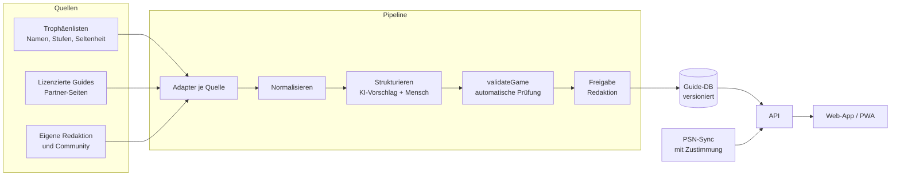

# Platinpfad: Technische Architektur

## Überblick

**Kernidee:** Ein Guide wird nicht als Text gespeichert, sondern als **strukturierte Daten** (Kapitel, Trophäen, Schritte, Phasen, Sammelobjekte). Nur so weiss die App, was *jetzt* relevant ist und was noch ein Spoiler wäre.

## Frontend

- **Web-App zuerst, als PWA:** läuft sofort auf Handy, Tablet und PC und lässt sich auf den Homescreen legen. Die Guides werden offline gecacht, falls im Spielzimmer das WLAN schwach ist.
- **Stack:** React + TypeScript + Vite (wie im Prototyp). Kein UI-Framework, eigene Design-Tokens in `src/styles.css`, Hell- und Dunkelmodus.
- **Später eine native Hülle** (z. B. Capacitor), wenn App-Store-Präsenz oder Push-Mitteilungen nötig werden. Der Code bleibt derselbe.

## Datenmodell

Definiert in [`src/types.ts`](../src/types.ts):

| Typ | Zweck |
|---|---|
| `Game` | Spiel mit Steckbrief (`meta`), Kapiteln, Trophäen, Schritten, Phasen, Sammeltypen, Quellen |
| `Chapter` | Spoilerfreies Label („Mission 7“), echter Titel, Akt, Sammelobjekte, `pointOfNoReturn` |
| `Trophy` | Offizielle Daten + `missable`, `availableFrom`, `missableUntil`, `recovery`, gestufte `hints` |
| `Step` | Ein Navi-Schritt: Art (`missable`, `ponr`, `trophy`, `collectible`, `tip`), spoilerfreier Titel, Hinweise, verknüpfte Trophäen |
| `Phase` | Abschnitt der Roadmap (Story → Aufräumen → Grind) |
| `GameProgress` | Stand des Spielers: Kapitel, Modus, Spoiler-Schutz, geholte Trophäen, erledigte Schritte, Zähler |

Die Logik dazu liegt in [`src/lib/navigator.ts`](../src/lib/navigator.ts): nächster Schritt, Missables in Gefahr, Points of No Return, Spoiler-Regeln, PSN-Punkte. Sie hat keine Abhängigkeit zur Oberfläche und ist mit Tests abgedeckt. Dieselbe Logik kann später serverseitig laufen, etwa für Push-Mitteilungen.

## Datenbeschaffung

Das ist der heikelste Teil des Projekts. Deshalb ist er hier ausführlich beschrieben.

### Was nicht geht: Guides von PowerPyx & Co. scrapen

Guide-Texte, Roadmaps, Screenshots und Videos von PowerPyx, PSNProfiles, PlayStationTrophies, TrueTrophies usw. sind **urheberrechtlich geschützt**. Die Nutzungsbedingungen dieser Seiten verbieten automatisiertes Auslesen in der Regel. Wer die Inhalte automatisch abgreift und in der eigenen App neu ausspielt, riskiert:

- Abmahnungen und Unterlassungsansprüche (Urheberrecht; in der EU zusätzlich das Schutzrecht für Datenbanken, wenn wesentliche Teile systematisch übernommen werden)
- Sperren durch die Seiten (technisch leicht umzusetzen)
- schlechten Ruf in der Trophy-Community: Diese Seiten leben von Werbeeinnahmen, und eine App, die ihnen den Traffic wegnimmt, macht sich dort keine Freunde

*Keine Rechtsberatung. Vor dem Launch sollte das anwaltlich geprüft werden.*

### Was geht

| Weg | Inhalt | Bemerkung |
|---|---|---|
| **Partnerschaft / Lizenz** mit Guide-Autoren | Strukturierte Guides, Hinweise | Bester Weg zu Qualität und Masse. Angebot: Umsatzbeteiligung, prominente Nennung, Link zum Original-Guide für Details. Für viele Autoren ist das eine neue Einnahmequelle. |
| **Eigene Redaktion** | Schritte, Hinweise in drei Stufen, Kapitel-Zuordnung | Für den Start mit 5–10 grossen Releases realistisch. Fakten (z. B. „Kapitel 3 hat 4 Federn“, „verpassbar bis Kapitel 5“) dürfen recherchiert werden; die **Formulierung** ist immer eigene Arbeit. |
| **Community** | Korrekturen, neue Spiele | Wie ein Wiki, aber jede Änderung prüft die Redaktion. Funktioniert erst mit Reichweite. |
| **Link-out** | Details, Karten, Videos | Jede Quelle mit `usage: 'link'` wird nur verlinkt. Das bringt den Original-Seiten Traffic statt ihn wegzunehmen. |
| **Trophäenlisten** | Namen, Beschreibungen, Stufen, Seltenheit | Sony bietet keine offene, offizielle Trophäen-API. Community-Bibliotheken (z. B. `psn-api`) nutzen die Endpunkte der PlayStation-App mit dem Token des Nutzers. Für den Abgleich der *eigenen* Trophäen ist das verbreitet, rechtlich aber eine Grauzone. Vor dem Launch prüfen. |

### Partner-Inhalte direkt in der App (PowerPyx)

PowerPyx hat mündlich zugestimmt, dass wir die Inhalte der Guide-Seiten verwenden dürfen. **Vor dem ersten echten Import sollte das schriftlich festgehalten werden**: Texte *und* Bilder, kommerzielle Nutzung, Form der Quellenangabe, Umgang mit Aktualisierungen, Kündigung.

Damit ändert sich die Aufteilung: Die Details stehen jetzt **in der App**, nicht mehr hinter einem Link.

| | Was | Woher |
|---|---|---|
| **Gerüst** | Kapitel, welche Trophäe wo, was verpassbar ist, Points of No Return | Partner-Guide, ergänzt durch eigene Fakten, später automatisch aus Trophäen-Zeitstempeln |
| **Anleitung** (`Trophy.guide`) | Kurzfassung, Aufwand, Schwierigkeit, „Das brauchst du“, Schritte mit Screenshots, Tipps und Warnungen | Partner-Guide, in unsere Struktur übertragen |
| **Fundorte** (`Game.collectibleItems`) | Jedes Sammelobjekt einzeln: Stupser, genauer Ort, Screenshot mit Markierung | Partner-Guide |
| **Videos** | Nur noch Rückfallebene, wo es keine Anleitung gibt | YouTube-Suche ([`src/lib/links.ts`](../src/lib/links.ts)) |

**Bilder** werden beim Import auf den **eigenen Bildserver** kopiert, nicht direkt von der Partnerseite geladen. Das ist schneller, belastet den Partner nicht und funktioniert weiter, wenn sich dort Adressen ändern. Jedes Partner-Bild trägt einen Bildnachweis (`credit`). `validateGame` lehnt Partner-Bilder ohne Nachweis ab.

**Markierungen** (`ImageMark`) legen wir selbst über die Screenshots: Kreis plus Beschriftung in Prozent-Koordinaten, damit sie auf jeder Bildschirmgrösse passen. So zeigt jedes Bild genau die Stelle, um die es geht.

**Spoiler:** Abschnitte und Bilder können als Spoiler markiert werden. Sie bleiben unscharf bzw. verdeckt, bis man sie antippt, ausser der Spoiler-Schutz steht auf „Offen“.

### Import aus dem Partner-Guide

1. **Abrufen** auf unserem Server (nicht in der App), mit erkennbarem User-Agent und zurückhaltender Frequenz. Am besten liefert der Partner die Inhalte direkt, etwa als Export oder Feed.
2. **Zerlegen:** Trophäen-Abschnitte anhand der Trophäennamen erkennen, Sammelobjekt-Abschnitte anhand der Kapitel. Texte, Bilder und Bildunterschriften getrennt speichern.
3. **Zuordnen:** Trophäen über den Namen auf unsere IDs abbilden, Bilder auf den eigenen Bildserver kopieren.
4. **Strukturieren:** Eine KI macht daraus den Vorschlag für Kurzfassung, „Das brauchst du“, Schritte, Tipps und Warnungen. Dazu kommen die drei Hinweisstufen und die Spoiler-Markierungen. Ein Mensch prüft und setzt die Markierungen auf den Screenshots.
5. **Prüfen** mit `validateGame` und **veröffentlichen**. Ändert der Partner seinen Guide, läuft der Import erneut, und Änderungen werden zur Freigabe angezeigt.

Die HTML-Struktur der PowerPyx-Seiten konnte noch nicht analysiert werden, weil die Seite aus der bisherigen Entwicklungsumgebung nicht erreichbar war. Der Parser (Schritt 2) ist deshalb noch offen.

### Die Pipeline

1. **Adapter** pro Quelle ([`src/sources/types.ts`](../src/sources/types.ts)). Jeder Adapter erklärt, was er liefern *darf* (`provides`) und wie die Inhalte genutzt werden (`usage`).
2. **Normalisieren:** Trophäen aus verschiedenen Quellen auf dieselbe ID abbilden.
3. **Strukturieren:** Eine KI (z. B. Claude) macht aus *eigenem oder lizenziertem* Material einen Vorschlag: Kapitel, Schritte, Missables, Points of No Return und Hinweise in drei Spoiler-Stufen. Ein Mensch prüft und korrigiert.
4. **Validieren** mit [`validateGame`](../src/lib/validate.ts). Es prüft automatisch unter anderem:
   - Jede verpassbare Trophäe hat einen Schritt, der rechtzeitig warnt
   - Kein Schritt-Titel verrät eine versteckte Trophäe
   - Sammelobjekt-Summen pro Kapitel ergeben die Gesamtzahl
   - Jede Trophäe steht in genau einer Phase der Route
   - Die Hinweisstufen sind vollständig
5. **Freigabe** durch die Redaktion, danach **versioniert veröffentlichen**. Patches, die etwas ändern (z. B. ein Missable wird entschärft), ergeben eine neue Version.

## Backend (ab MVP)

- **Datenbank:** Postgres. Guides als versionierte JSON-Dokumente (`guides: game_id, version, status, data`), Fortschritt pro Nutzer und Spiel (`progress: user_id, game_id, data, updated_at`).
- **API:** TypeScript (z. B. Hono oder Fastify), dieselben Typen wie im Frontend.
- **Login:** Passkeys oder E-Mail-Link, keine Passwörter.
- **Für den MVP pragmatisch:** Supabase (Postgres + Auth) und Hosting der PWA auf einem statischen Host.
- **Worker:** Import-Pipeline und PSN-Sync als Hintergrundjobs.

## Fortschritt und Sync

| Stufe | Wie |
|---|---|
| Prototyp (jetzt) | `localStorage` im Browser |
| MVP | Konto, Sync über Geräte |
| PSN-Sync | Geholte Trophäen automatisch übernehmen. Aus den Story-Trophäen ergibt sich das aktuelle Kapitel, ganz ohne Eintippen. |

## Roadmap

| Phase | Inhalt |
|---|---|
| **0 · Prototyp** (dieser Stand) | Klickbarer Prototyp, Datenmodell, Navi-Logik, Datenprüfung, Tests |
| **1 · MVP** | Konto und Sync, Offline-PWA, 5–10 aktuelle Releases redaktionell, Editor für Guides (Formular statt JSON), Knopf „Hinweis stimmt nicht“ |
| **2 · PSN** | Trophäenlisten importieren, geholte Trophäen abgleichen, automatische Kapitelerkennung |
| **3 · Inhalte skalieren** | Partner-Guides, Community-Beiträge mit Review, KI-gestützte Strukturierung |
| **4 · Mehr Spass, mehr Plattformen** | Session-Planer, Trophäenschrank, Xbox/Steam, native App |
